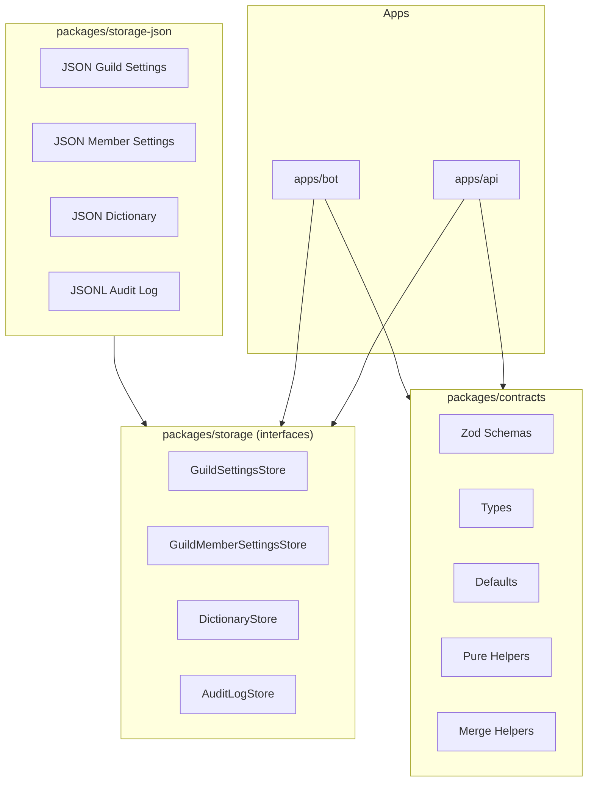
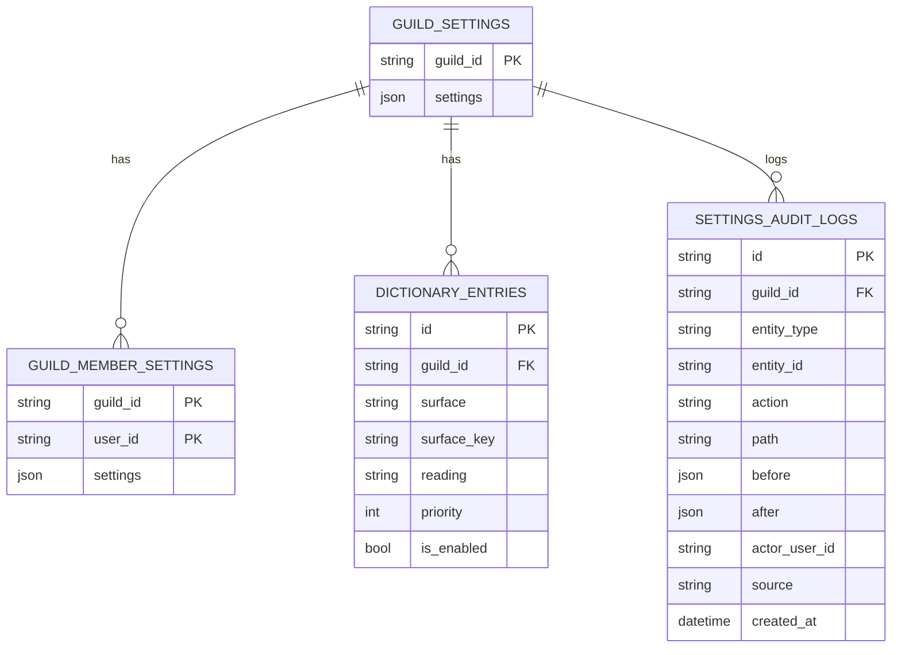

# Contracts & Storage 設計（フェーズ1 / v2 確定版）

本ドキュメントは、Discord読み上げBot「Yomicord」における  
**設定・辞書・監査ログのデータ構造（Contracts）** と  
**永続化の抽象化（Storage / Store インターフェース）** を定義する。

フェーズ1では DB を導入せず、**JSONファイルを永続化先**とする。  
ただし、**後から DB（PostgreSQL 等）へ差し替えることを前提**として設計する。

---

## 1. 設計方針（最重要）

- データ構造の唯一の正は **packages/contracts**
- 永続化方式（JSON / DB）は **Store インターフェースで完全分離**
- apps/api / apps/bot は **保存方式を一切知らない**
- JSONファイルは「仮のDB」であり、後で差し替える
- 監査ログはフェーズ1から必ず残す
- **接続中のみ有効な状態（読み上げ対象チャンネル等）は永続化しない**

---

## 2. 命名規則（厳守）

### 2.1 TypeScript / JSON

- camelCase
- 単数形
- 型名は PascalCase

例：

- `GuildSettings`
- `GuildMemberSettings`
- `DictionaryEntry`
- `SettingsAuditLog`
- `surfaceKey`, `isEnabled`

### 2.2 テーブル / 論理ストレージ

- snake_case
- 複数形

例：

- `guild_settings`
- `guild_member_settings`
- `dictionary_entries`
- `settings_audit_logs`

### 2.3 Mermaid ER 図

- UPPER_SNAKE_CASE
- 複数形（テーブル名に一致）

---

## 3. 全体構成（レイヤ構造）



---

## 4. エンティティ関係（ER 図）

> **注記**: ER図内のカラム名は snake_case で記載しています。
> これは将来の DB 移行時のカラム名を示すものであり、
> TypeScript / JSON では camelCase（2.1節参照）を使用します。



---

## 5. Contracts（packages/contracts）

### 5.1 GuildSettings（サーバー設定）

#### 役割

- 1 guild = 1 設定
- サーバー全体の読み上げ方針・音声デフォルトを定義
- **読み上げ対象テキストチャンネルは含まない**

#### 正式 JSON 形（デフォルト）

```json
{
  "voice": {
    "engine": "voicevox",
    "speakerId": 1,
    "volume": 1.0,
    "speed": 1.0,
    "pitch": 0.0,
    "intonation": 1.0
  },
  "nameRead": {
    "nameSource": "NICKNAME",
    "prefix": "",
    "suffix": "さん",
    "repeatMode": "ON_CHANGE",
    "cooldownSec": 120,
    "normalizeDefault": true
  },
  "filters": {
    "mentionMode": "EXPAND",
    "urlMode": "DOMAIN_ONLY",
    "emojiMode": "IGNORE",
    "codeBlockMode": "SAY_CODE",
    "attachmentMode": "TYPE_ONLY",
    "newlineMode": "JOIN"
  },
  "limits": {
    "maxHiraganaLength": 120,
    "overLimitAction": "SAY_ARYAKU"
  },
  "announce": {
    "onConnect": true,
    "onStartStop": false,
    "customText": null
  },
  "permissions": {
    "manageMode": "ADMIN_ONLY",
    "allowedRoleIds": []
  }
}
```

---

### 5.2 GuildMemberSettings（ユーザー設定）

#### 役割

- guild 内 member ごとの **部分上書き設定**
- 上書きが存在する場合のみ保存
- 意味のある上書きが無くなった場合は削除

#### JSON 形（部分上書き）

```json
{
  "voice": {
    "speakerId": 14,
    "speed": 1.1
  },
  "nameRead": {
    "normalize": "inherit"
  }
}
```

#### 設計上の制約

- `voice.engine` は **フェーズ1では存在しない**
  - サーバー全体の音声世界観を維持するため
  - engine 切替は CPU / メモリ負荷・互換性差が大きいため
  - 将来的にユーザー別 engine 許可を検討（11節参照）

- `nameRead.normalize`:
  - `"inherit"` | `"on"` | `"off"`

#### 削除判定（canonicalize）

- `voice` が空 → 削除
- `nameRead.normalize === "inherit"` → nameRead 削除
- 結果 `{}` → row 削除

---

### 5.3 DictionaryEntry（本文辞書）

#### 適用範囲（重要）

- **本文のみ**
- 名前読みには一切適用しない（フェーズ1確定）

```json
{
  "id": "uuid",
  "guildId": "123",
  "surface": "API",
  "surfaceKey": "api",
  "reading": "エーピーアイ",
  "priority": 10,
  "isEnabled": true
}
```

#### surfaceKey 正規化（フェーズ1確定）

```
normalizeSurface(surface):
  1. Unicode NFKC
  2. trim
  3. 英字を小文字化
  4. 連続空白を半角1つに畳む
```

- 記号は除去しない
- `guildId + surfaceKey` はユニーク
- 重複登録はエラー

#### 適用順

1. priority 降順
2. surface.length 降順
3. id 昇順

---

### 5.4 SettingsAuditLog（監査ログ）

#### entityType / entityId

| entityType            | entityId             |
| --------------------- | -------------------- |
| guild_settings        | null                 |
| guild_member_settings | `{guildId}:{userId}` |
| dictionary_entry      | `<entryId>`          |

#### action / path ルール

| action | path      |
| ------ | --------- |
| create | null      |
| delete | null      |
| update | `"a.b.c"` |

- before / after は **変更されたフィールドのみ**

```json
{
  "id": "uuid",
  "guildId": "123",
  "entityType": "dictionary_entry",
  "entityId": "abc-uuid",
  "action": "update",
  "path": "reading",
  "before": { "reading": "えーぴーあい" },
  "after": { "reading": "エーピーアイ" },
  "actorUserId": "456",
  "source": "command",
  "createdAt": "2026-01-01T12:00:00Z"
}
```

---

## 6. Actor（操作コンテキスト）

Actor は **永続化しない入力情報**。

```ts
export type Actor = {
  userId: string | null;
  displayName?: string | null;
  source: 'command' | 'api' | 'system' | 'migration';
  occurredAt: string;
};
```

#### displayName の扱い

- `displayName` は **永続化しない**
- 監査ログ表示時は Discord API からユーザー情報を別途取得する
- Store への入力時に渡すが、`SettingsAuditLog` には保存しない

---

## 7. Storage 境界（packages/storage）

### 7.0 責務分担（重要）

| 責務                                                | 担当                                    |
| --------------------------------------------------- | --------------------------------------- |
| デフォルト値の生成                                  | packages/contracts（defaults ヘルパー） |
| 設定のマージ（GuildSettings + GuildMemberSettings） | packages/contracts（merge ヘルパー）    |
| 永続化（保存/読み出し）                             | Store                                   |
| 既存データへのフィールド追加（マイグレーション）    | Store（読み出し時に migrate/normalize） |
| 重複チェック（DictionaryEntry の surfaceKey）       | Store                                   |

#### マージヘルパー（packages/contracts）

```ts
// GuildSettings と GuildMemberSettings をマージして最終的な音声設定を返す
function mergeVoiceSettings(
  guild: GuildSettings,
  member: GuildMemberSettings | null,
): ResolvedVoiceSettings;

// 名前読み設定のマージ
function mergeNameReadSettings(
  guild: GuildSettings,
  member: GuildMemberSettings | null,
): ResolvedNameReadSettings;
```

- apps/bot は上記ヘルパーを呼び出してマージ済み設定を取得する
- マージロジックは Contracts に閉じ込め、apps 層に漏らさない

### 7.1 GuildSettingsStore

```ts
interface GuildSettingsStore {
  /**
   * 指定 guildId の設定を取得。存在しない場合はデフォルト値で新規作成。
   * - デフォルト値は contracts の defaults ヘルパーから取得
   * - 既存データにフィールド不足がある場合は読み出し時に migrate/normalize
   */
  getOrCreate(guildId: string): Promise<GuildSettings>;
  update(guildId: string, next: GuildSettings, actor: Actor): Promise<void>;
}
```

### 7.2 GuildMemberSettingsStore

```ts
interface GuildMemberSettingsStore {
  get(guildId: string, userId: string): Promise<GuildMemberSettings | null>;
  upsert(
    guildId: string,
    userId: string,
    partial: GuildMemberSettings,
    actor: Actor,
  ): Promise<void>;
  delete(guildId: string, userId: string, actor: Actor): Promise<void>;
}
```

### 7.3 DictionaryStore

```ts
interface DictionaryStore {
  listByGuild(guildId: string): Promise<DictionaryEntry[]>;

  /**
   * 辞書エントリを新規作成。
   * @throws DuplicateSurfaceKeyError - guildId + surfaceKey が既に存在する場合
   */
  create(guildId: string, entry: DictionaryEntry, actor: Actor): Promise<void>;

  update(
    guildId: string,
    entryId: string,
    patch: Partial<Pick<DictionaryEntry, 'reading' | 'priority' | 'isEnabled'>>,
    actor: Actor,
  ): Promise<void>;

  delete(guildId: string, entryId: string, actor: Actor): Promise<void>;
}
```

### 7.4 AuditLogStore

```ts
interface AuditLogStore {
  append(log: SettingsAuditLog): Promise<void>;

  /**
   * 指定 guildId の監査ログを取得。
   * @returns createdAt 降順（新しい順）で最大 limit 件
   */
  listByGuild(guildId: string, limit: number): Promise<SettingsAuditLog[]>;
}
```

---

## 8. JSON ファイル Store（フェーズ1）

### 保存構成

```
data/
  guild-settings/{guildId}.json
  guild-members/{guildId}/{userId}.json
  dictionary/{guildId}.json
  audit/{guildId}.log.jsonl
```

### 同時書き込み前提

- 単一インスタンス運用
- atomic write + in-process mutex
- 複数インスタンスは DB 移行で対応

---

## 9. Runtime State（永続化しない）

```ts
type ReadSession = {
  guildId: string;
  voiceChannelId: string;
  textChannelIds: Set<string>;
  joinedAt: string;
};
```

- `/join` 時に生成
- `/leave` / 自動切断で破棄
- **apps/bot 内ローカル型**

---

## 10. 補足仕様（確定）

- `voice.speakerId`: number（v1固定）
- `nameRead.cooldownSec = 0`: 毎回名前を読む
- `limits.maxHiraganaLength`:
  - 読み上げ直前の正規化後テキスト
  - 厳密一致ではなく安全側

- `filters.codeBlockMode = SAY_CODE`:
  - 「コードがあります」と読む

- `Actor.displayName`:
  - 永続化しない（6節参照）
  - 表示時は Discord API から取得

---

## 11. 将来拡張（フェーズ2以降）

- schemaVersion 導入
- ユーザー別 engine 許可
- 名前読み専用辞書
- DB（PostgreSQL）移行

---

## 12. フェーズ1ゴール

- Contracts が唯一の正
- JSON → DB 差し替え可能
- Runtime State と永続データが分離
- Codex 実装がブレない
