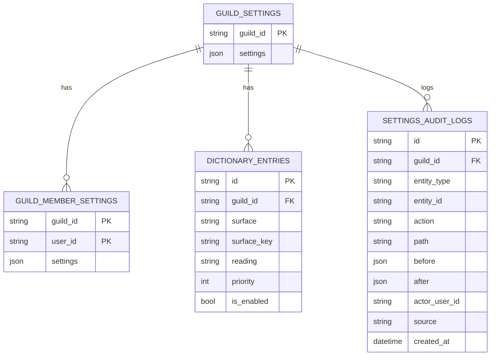

# エンティティ仕様

## 1. エンティティ関係（ER 図）

> **注記**: ER図内のカラム名は snake_case で記載しています。
> これは将来の DB 移行時のカラム名を示すものであり、
> TypeScript / JSON では camelCase（命名規則を参照）を使用します。



---

## 2. Contracts（packages/contracts）

### 2.1 GuildSettings（サーバー設定）

#### 役割

- 1 guild = 1 設定
- サーバー全体の読み上げ方針・音声デフォルトを定義
- **読み上げ対象テキストチャンネルは含まない**
- `opsNotify` は、サーバーに対して運用上の通知を行うことに関する設定

#### 正式 JSON 形（デフォルト）

```json
{
  "voice": {
    "engine": "voicevox",
    "speakerId": 1,
    "volume": 1.0,
    "speed": 1.0,
    "pitch": 0.0,
    "intonation": 1.0
  },
  "nameRead": {
    "nameSource": "NICKNAME",
    "prefix": "",
    "suffix": "さん",
    "repeatMode": "ON_CHANGE",
    "cooldownSec": 120,
    "normalizeDefault": true
  },
  "filters": {
    "mentionMode": "EXPAND",
    "urlMode": "DOMAIN_ONLY",
    "emojiMode": "IGNORE",
    "codeBlockMode": "SAY_CODE",
    "attachmentMode": "TYPE_ONLY",
    "newlineMode": "JOIN"
  },
  "limits": {
    "maxHiraganaLength": 120,
    "overLimitAction": "SAY_IKARYAKU"
  },
  "announce": {
    "onConnect": true,
    "onStartStop": false,
    "customText": null
  },
  "permissions": {
    "manageMode": "ADMIN_ONLY",
    "allowedRoleIds": []
  },
  "opsNotify": {
    "channelId": null,
    "levelMin": "NOTICE"
  }
}
```

---

### 2.2 GuildMemberSettings（ユーザー設定）

#### 役割

- guild 内 member ごとの **部分上書き設定**
- 上書きが存在する場合のみ保存
- 意味のある上書きが無くなった場合は削除

#### JSON 形（部分上書き）

```json
{
  "voice": {
    "speakerId": 14,
    "speed": 1.1
  },
  "nameRead": {
    "normalize": "inherit"
  }
}
```

#### 設計上の制約

- `voice.engine` は **フェーズ1では存在しない**
  - サーバー全体の音声世界観を維持するため
  - engine 切替は CPU / メモリ負荷・互換性差が大きいため
- 将来的にユーザー別 engine 許可を検討（`docs/storage/roadmap.md` を参照）

- `nameRead.normalize`:
  - `"inherit"` | `"on"` | `"off"`

#### 削除判定（canonicalize）

- `voice` が空 → 削除
- `nameRead.normalize === "inherit"` → nameRead 削除
- 結果 `{}` → row 削除

---

### 2.3 DictionaryEntry（本文辞書）

#### 適用範囲（重要）

- **本文のみ**
- 名前読みには一切適用しない（フェーズ1確定）

```json
{
  "id": "uuid",
  "guildId": "123",
  "surface": "API",
  "surfaceKey": "api",
  "reading": "エーピーアイ",
  "priority": 10,
  "isEnabled": true
}
```

#### surfaceKey 正規化（フェーズ1確定）

```
normalizeSurface(surface):
  1. Unicode NFKC
  2. trim
  3. 英字を小文字化
  4. 連続空白を半角1つに畳む
```

- 記号は除去しない
- `guildId + surfaceKey` はユニーク
- 重複登録はエラー

#### 適用順

1. priority 降順
2. surface.length 降順
3. id 昇順

---

### 2.4 SettingsAuditLog（監査ログ）

#### entityType / entityId

| entityType            | entityId             |
| --------------------- | -------------------- |
| guild_settings        | null                 |
| guild_member_settings | `{guildId}:{userId}` |
| dictionary_entry      | `<entryId>`          |

#### action / path ルール

| action | path      |
| ------ | --------- |
| create | null      |
| delete | null      |
| update | `"a.b.c"` |

- before / after は **変更されたフィールドのみ**

```json
{
  "id": "uuid",
  "guildId": "123",
  "entityType": "dictionary_entry",
  "entityId": "abc-uuid",
  "action": "update",
  "path": "reading",
  "before": { "reading": "えーぴーあい" },
  "after": { "reading": "エーピーアイ" },
  "actorUserId": "456",
  "source": "command",
  "createdAt": "2026-01-01T12:00:00Z"
}
```

#### 保存ルール（API 側）

- 監査ログは **更新系 API のみ**で保存する（GET/閲覧は対象外）。
- 監査ログの追記は **同期的**に行い、追記失敗時は **API は成功を返す**（運用で検知・補完する）。
- 変更が複数ある場合は **変更ごとに 1 ログ**を作成する。
  - 同一リクエスト内の複数ログは `createdAt` を同一にする。
  - 同一リクエスト内の複数ログは `entityId` を同一にする。
  - 並び順は `path` の辞書順で安定化させる。
  - `path = null` のログは末尾に置く。
- `before` / `after` は **変更部分のみ**を保持する。
- 差分抽出は **ネストまで含む深い比較**とし、`path` は `"a.b.c"` の形式で記録する。
- `createdAt` は `X-Yomicord-Actor-Occurred-At` を優先し、未指定時は API 時刻を使用する。

#### 作成 / 削除時の before / after ルール

- DictionaryEntry:
  - create: `before = {}` / `after = { surface, surfaceKey, reading, priority, isEnabled }`
  - delete: `before = { surface, surfaceKey, reading, priority, isEnabled }` / `after = {}`
- GuildMemberSettings:
  - create: `before = {}` / `after = { voice?, nameRead? }`
  - delete: `before = { voice?, nameRead? }` / `after = {}`
- GuildSettings:
  - 更新時は差分のみ（複数項目は複数ログ）。
  - 作成/削除は原則発生しない（必要になった場合は別途定義）。

#### 差分抽出の実装ガイド（API 層）

- 差分検出は **リーフレベル**（最も深い変更箇所）で行う。
  - 例: `voice.speakerId` が変更なら `path = "voice.speakerId"`
- 配列の変更は配列全体を before/after に含める。
  - 例: `allowedRoleIds` 変更なら `path = "permissions.allowedRoleIds"`
- path のソートは JavaScript の `Array.prototype.sort()` による昇順。
  - `path = null` は末尾に配置。
- 差分抽出ヘルパーは packages/contracts に配置する。
  - `computeGuildSettingsDiff(before, after): Diff[]`
  - `computeDictionaryEntryDiff(before, after): Diff[]`
  - `computeGuildMemberSettingsDiff(before, after): Diff[]`

#### GuildMemberSettings の監査ログ詳細

- 新規作成: `action = "create"`, `path = null`, `before = {}`, `after = { 全体 }`
- 更新: 変更されたフィールドごとに 1 ログ（リーフレベル）
- 削除: `action = "delete"`, `path = null`, `before = { 全体 }`, `after = {}`

#### DictionaryEntry の監査ログ詳細

- 作成: `action = "create"`, `path = null`, `before = {}`, `after = { 全体 }`
- 更新: 変更されたフィールドごとに 1 ログ（リーフレベル）
- 削除: `action = "delete"`, `path = null`, `before = { 全体 }`, `after = {}`

---

## 3. 補足仕様（確定）

- `voice.speakerId`: number（v1固定）
- `nameRead.cooldownSec = 0`: 毎回名前を読む
- `limits.maxHiraganaLength`:
  - 読み上げ直前の正規化後テキスト
  - 厳密一致ではなく安全側

- `filters.codeBlockMode = SAY_CODE`:
  - 「コードがあります」と読む

- `Actor.displayName`:
  - 永続化しない（Actor を参照）
  - 表示時は Discord API から取得

- `opsNotify.channelId`:
  - string | null
  - nullの場合はサーバーに対して通知を行わない
