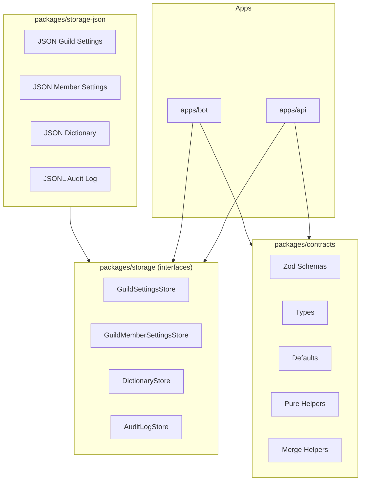

# Storage 境界の概要

## 1. 全体構成（レイヤ構造）



---

## 2. 責務分担（重要）

| 責務                                                | 担当                                    |
| --------------------------------------------------- | --------------------------------------- |
| デフォルト値の生成                                  | packages/contracts（defaults ヘルパー） |
| 設定のマージ（GuildSettings + GuildMemberSettings） | packages/contracts（merge ヘルパー）    |
| 永続化（保存/読み出し）                             | Store                                   |
| 既存データへのフィールド追加（マイグレーション）    | Store（読み出し時に migrate/normalize） |
| 重複チェック（DictionaryEntry の surfaceKey）       | Store                                   |

### マージヘルパー（packages/contracts）

```ts
// GuildSettings と GuildMemberSettings をマージして最終的な音声設定を返す
function mergeVoiceSettings(
  guild: GuildSettings,
  member: GuildMemberSettings | null,
): ResolvedVoiceSettings;

// 名前読み設定のマージ
function mergeNameReadSettings(
  guild: GuildSettings,
  member: GuildMemberSettings | null,
): ResolvedNameReadSettings;
```

- apps/bot は上記ヘルパーを呼び出してマージ済み設定を取得する
- マージロジックは Contracts に閉じ込め、apps 層に漏らさない
